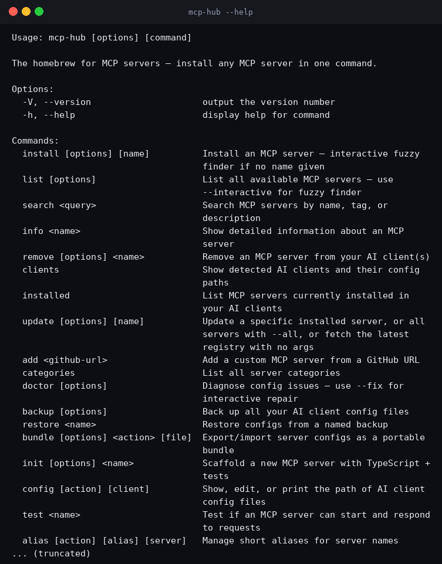
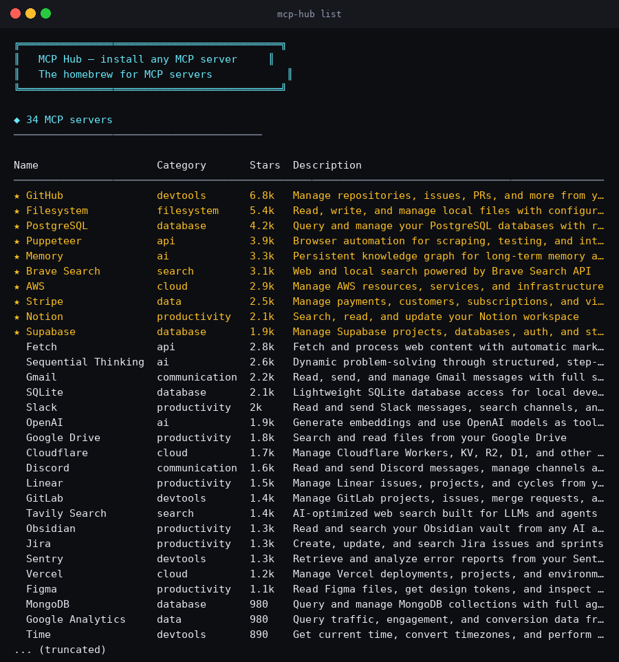
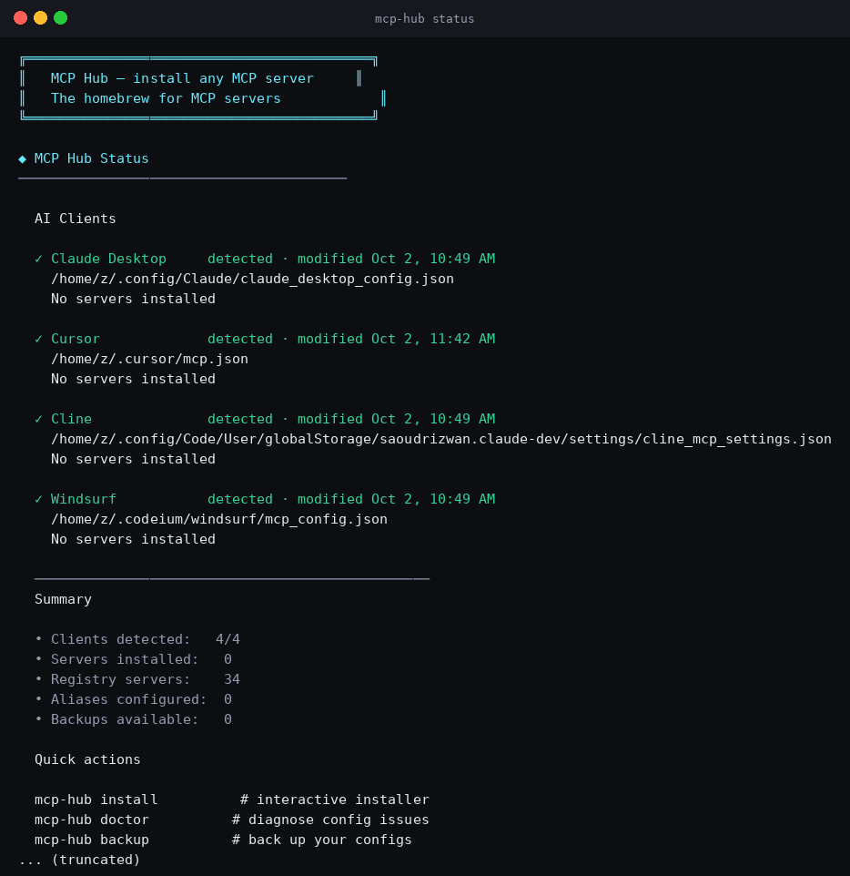
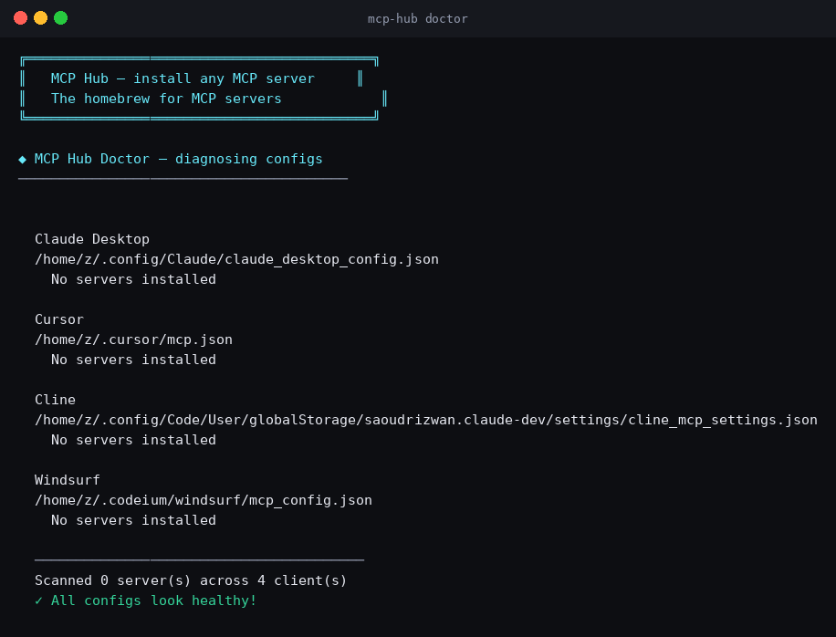
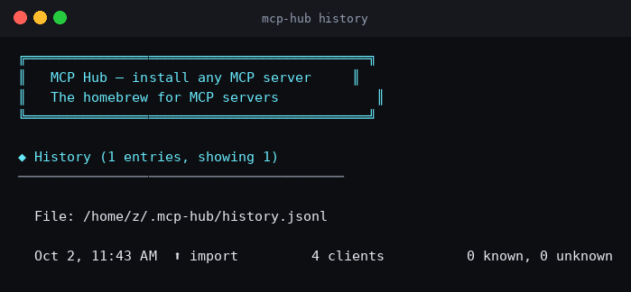
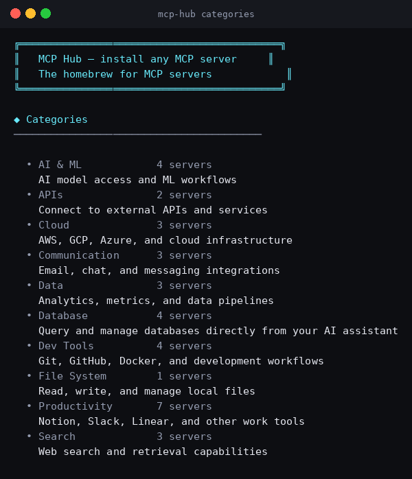

<div align="center">

<!-- 3D Logo Effect -->
<h1>
  
</h1>

<!-- Animated subtitle -->
<p>
  
</p>

<!-- Badges with animation -->
<p>
  <a href="https://github.com/e2sy/mcp-hub/stargazers"></a>
  
  
  
</p>
<p>
  
  
  
  
</p>

<!-- Quick links with 3D card effect -->
<p>
  <a href="#-quick-start"></a>
  <a href="#-cli-commands"></a>
  <a href="#-contributing--join-us"></a>
  <a href="#-roadmap"></a>
</p>

<!-- Animated wave -->


</div>

---

## 📊 Project Stats

<div align="center">
  <a href="https://github.com/e2sy/mcp-hub/releases"></a>
  <a href="https://github.com/e2sy/mcp-hub/issues"></a>
  <a href="https://github.com/e2sy/mcp-hub/pulls"></a>
  <a href="https://github.com/e2sy/mcp-hub/graphs/contributors"></a>
</div>
<div align="center">
  <a href="https://github.com/e2sy/mcp-hub"></a>
  <a href="https://github.com/e2sy/mcp-hub"></a>
  <a href="https://github.com/e2sy/mcp-hub"></a>
</div>

---

## 🚀 Quick Start

```bash
# Install any MCP server — no global install required
npx mcp-hub install github

# Or launch the interactive fuzzy finder
npx mcp-hub install
```

That's it. The CLI:
1. ✅ Auto-detects Claude Desktop, Cursor, Cline, and Windsurf on your machine
2. ✅ Backs up your existing config file
3. ✅ Writes the correct MCP server config to each client
4. ✅ Tells you exactly what it did

Restart your AI client and the server is live.

<details>
<summary><b>📖 Why MCP Hub? (click to expand)</b></summary>

<br/>

| Without MCP Hub | With MCP Hub |
|:---:|:---:|
| Search GitHub for an MCP server | `mcp-hub search "postgres"` |
| Read the README to find the config | `mcp-hub info postgres` |
| Find your client's config file path | Auto-detected |
| Manually edit JSON, hope you don't break it | `mcp-hub install postgres` |
| Repeat for each AI client you use | One command does all of them |
| No backup if something goes wrong | `.backup` file created automatically |
| No way to diagnose broken configs | `mcp-hub doctor` finds the issues |
| Can't share your setup with teammates | `mcp-hub bundle export` |
| Can't test if a server actually works | `mcp-hub test <name>` |

</details>

---

## 📸 Screenshots

<div align="center">
  <table>
    <tr>
      <td align="center"><b>mcp-hub --help</b></td>
      <td align="center"><b>mcp-hub list</b></td>
    </tr>
    <tr>
      <td></td>
      <td></td>
    </tr>
    <tr>
      <td align="center"><b>mcp-hub status</b></td>
      <td align="center"><b>mcp-hub doctor</b></td>
    </tr>
    <tr>
      <td></td>
      <td></td>
    </tr>
    <tr>
      <td align="center"><b>mcp-hub history</b></td>
      <td align="center"><b>mcp-hub categories</b></td>
    </tr>
    <tr>
      <td></td>
      <td></td>
    </tr>
  </table>
</div>

---

## 💻 CLI Commands

> **33 commands** covering the full lifecycle: discover → install → diagnose → fix → monitor → update → share → publish

<details open>
<summary><b>🔧 Core Commands</b></summary>

```bash
mcp-hub install [name]          # Install (interactive fuzzy finder if no name)
mcp-hub install <name> -c cursor # Install into a specific client only
mcp-hub list                    # List all available MCP servers
mcp-hub list --category database # Filter by category
mcp-hub list --featured         # Show only featured servers
mcp-hub list --interactive      # fzf-style browser
mcp-hub search "postgres"       # Search by name, tag, or description
mcp-hub info <name>             # Show detailed server info + config JSON
mcp-hub remove <name>           # Remove a server from all clients
```

</details>

<details>
<summary><b>🩺 Diagnostics & Monitoring</b></summary>

```bash
mcp-hub status                  # Dashboard — like git status for MCP
mcp-hub doctor                  # Diagnose config issues
mcp-hub doctor --fix            # Interactively fix issues
mcp-hub test <name>             # Spawn and verify a server responds
mcp-hub logs <name>             # Live log viewer (Ctrl+C to stop)
mcp-hub whoami                  # Show environment + detected clients
mcp-hub clients                 # Show detected AI clients + config paths
mcp-hub installed               # List what's currently installed
```

</details>

<details>
<summary><b>📦 Backup & Sharing</b></summary>

```bash
mcp-hub backup [--label <name>] # Back up all client config files
mcp-hub backup --list           # List available backups
mcp-hub backup --delete <name>  # Delete a backup
mcp-hub restore <name>          # Restore configs from a backup
mcp-hub bundle export <file>    # Export your setup as a portable JSON bundle
mcp-hub bundle install <file>   # Install all servers from a bundle
```

</details>

<details>
<summary><b>⚡ Updates, Scaffolding & Publishing</b></summary>

```bash
# Updates
mcp-hub outdated                # Check for CLI + server updates
mcp-hub upgrade                 # Upgrade the CLI to latest
mcp-hub upgrade --all           # Upgrade CLI + refresh all servers
mcp-hub update                  # Fetch the latest registry
mcp-hub update <name>           # Refresh one server's config
mcp-hub update --all            # Refresh all installed servers

# Scaffolding
mcp-hub init <name>             # Scaffold a new MCP server (TypeScript)
mcp-hub config show [client]    # Pretty-print config
mcp-hub config edit [client]    # Open config in $EDITOR
mcp-hub config-import           # Import existing configs from AI clients
mcp-hub alias add <alias> <srv> # Short name (e.g. gh → github)
mcp-hub alias list              # Show all aliases
mcp-hub add <github-url>        # Get config for a custom server
mcp-hub categories              # List all categories

# Publishing & Sharing
mcp-hub publish --category <c>  # Submit your server to the directory
mcp-hub history                 # Show your action log
mcp-hub history --clear         # Clear history
mcp-hub bundle-share share      # Share your setup via short ID
mcp-hub bundle-join <id>        # Install from a shared bundle
mcp-hub completions <shell>     # Generate bash/zsh/fish completions
```

</details>

---

## 🧠 AI Skills Marketplace

MCP Hub doesn't just install MCP servers — it also installs **skill packs** that make your AI assistant smarter at specific tasks.

### 29 built-in skills across 11 categories

| Category | Skills | Example |
|----------|--------|---------|
| **Coding** | 7 | Clean Code, Code Reviewer, TypeScript Expert, System Design, React Expert, Interview Prep |
| **Marketing** | 3 | Growth Marketer, SEO Expert, Social Media Pro |
| **Security** | 4 | Security Auditor, Pentester, Cloud Security, Compliance Officer |
| **Writing** | 2 | Copywriter, Technical Writer |
| **Business** | 3 | Startup Advisor, Product Manager, B2B Sales |
| **AI & ML** | 2 | Prompt Engineer, RAG System Builder |
| **DevOps** | 4 | Docker Pro, Kubernetes Expert, AWS Pro, CI/CD Pipelines |
| **Design** | 1 | UI/UX Designer |
| **Data** | 1 | SQL Expert |
| **Productivity** | 1 | Productivity System (GTD) |
| **Languages** | 1 | Language Tutor |

### Add your own skills from GitHub

Found a skill pack on GitHub? Add it with one command:

```bash
# Add from any GitHub repo
mcp-hub skill add https://github.com/yaklang/hack-skills

# List your custom skills
mcp-hub skill list-custom

# Install to your AI clients
mcp-hub skill install hack-skills

# Update (re-fetch from GitHub)
mcp-hub skill update hack-skills

# Remove
mcp-hub skill remove-custom hack-skills
```

**Any public GitHub repo with a markdown file works.** MCP Hub:
1. Fetches the content from GitHub
2. Auto-detects name, category, and description
3. Saves it locally
4. Makes it available for install alongside built-in skills

### Skill commands

```bash
mcp-hub skill list                    # browse all 29+ skills
mcp-hub skill list --category coding  # filter by category
mcp-hub skill list --installed        # show installed skills
mcp-hub skill install <name>          # install a skill
mcp-hub skill remove <name>           # remove a skill
mcp-hub skill search <query>          # search all skills
mcp-hub skill info <name>             # detailed info + preview
mcp-hub skill categories              # list all 11 categories
mcp-hub skill add <github-url>        # add custom skill from GitHub
mcp-hub skill update <slug>           # re-fetch custom skill
mcp-hub skill list-custom             # list custom skills
mcp-hub skill remove-custom <slug>    # remove custom skill
```

---

## 🌐 Website & Docs

| Page | What it does |
|------|-------------|
| **Landing page** | Hero, AI recommender, CLI showcase, directory browser, FAQ |
| **/servers** | Full directory with search, filters, category chips |
| **/servers/[slug]** | Individual server pages with SEO, JSON-LD, config tabs |
| **/cli** | CLI documentation with command reference |
| **/docs** | 24-page docs site with Cmd+K search (like Stripe/Vercel docs) |

**Special features:**
- 🤖 **AI-powered server recommender** — Describe what you want to build, get recommendations
- 🔍 **Public APIs** — `/api/search`, `/api/recommend`, `/api/servers`
- 🖼️ **Dynamic OG images** — Auto-generated social cards
- 🌙 **Dark mode** — Clean monochrome design
- 📱 **Mobile-responsive** — Works on every device

---

## 🤝 Contributing — Join Us!

<div align="center">
  
</div>

We welcome contributions of all kinds — no experience too small. This is an indie-built project and we treat every contributor like family.

### 🎯 Ways to Contribute

<details open>
<summary><b>1. ⭐ Star the repo (easiest, takes 1 second)</b></summary>

Just click the ⭐ button at the top right of [this repo](https://github.com/e2sy/mcp-hub). It helps other devs discover MCP Hub.

</details>

<details>
<summary><b>2. 🗄️ Add your MCP server to the directory</b></summary>

Built an MCP server? Add it to the directory and get it in front of thousands of devs:

1. Fork the repo
2. Add your server entry to `scripts/seed.ts` (use an existing entry as a template)
3. Run `bun run scripts/export-registry.ts`
4. Open a PR

We review within 48 hours. Verified servers get a ✅ badge. See [CONTRIBUTING.md](CONTRIBUTING.md) for the full guide.

</details>

<details>
<summary><b>3. 🐛 Report bugs</b></summary>

Found a bug? [Open a bug report](https://github.com/e2sy/mcp-hub/issues/new?template=bug_report.md) with:
- Your OS and Node.js version (`mcp-hub whoami` output)
- The exact command you ran
- The full error output
- Your AI client (Claude Desktop / Cursor / Cline / Windsurf)

</details>

<details>
<summary><b>4. ✨ Suggest features</b></summary>

Have an idea? [Open a feature request](https://github.com/e2sy/mcp-hub/issues/new?template=feature_request.md) and tell us:
- What problem does this solve?
- What's your current workaround?
- Any ideas for the API/design?

</details>

<details>
<summary><b>5. 💻 Write code</b></summary>

**Good first issues** (perfect for new contributors):
- [Add more shell completion patterns](https://github.com/e2sy/mcp-hub/issues) — `good first issue`
- [Add `mcp-hub config validate`](https://github.com/e2sy/mcp-hub/issues) — `good first issue`
- [Improve error messages](https://github.com/e2sy/mcp-hub/issues) — `good first issue`

**Bigger projects:**
- VS Code extension
- `mcp-hub ui` local web dashboard
- `mcp-hub run <name>` interactive REPL
- Community ratings and reviews

See [Development Setup](#-development-setup) below to get started.

</details>

<details>
<summary><b>6. 📖 Improve the docs</b></summary>

Every docs page has an "Edit on GitHub" link. Found a typo? Want to add an example? Just click and edit — no setup required.

Docs source: `src/lib/doc-content.tsx`

</details>

<details>
<summary><b>7. 💬 Help others in Discussions</b></summary>

Answer questions in [GitHub Discussions](https://github.com/e2sy/mcp-hub/discussions). It's the best way to build reputation in the community.

</details>

<details>
<summary><b>8. 🐦 Spread the word</b></summary>

Share MCP Hub on Twitter, Indie Hackers, r/cursor, Show HN, your blog, your newsletter, your Discord server. Every share helps.

[](https://twitter.com/intent/tweet?text=Check%20out%20MCP%20Hub%20—%20the%20homebrew%20for%20MCP%20servers!&url=https://github.com/e2sy/mcp-hub)
[](https://www.reddit.com/submit?url=https://github.com/e2sy/mcp-hub&title=MCP+Hub+—+homebrew+for+MCP+servers)

</details>

### 🏆 Contributors

<div align="center">
  <a href="https://github.com/e2sy/mcp-hub/graphs/contributors">
    
  </a>
</div>

### 💖 Sponsors

<div align="center">

[](https://github.com/sponsors/e2sy)

</div>

---

## 🛠️ Development Setup

```bash
# Clone the repo
git clone https://github.com/e2sy/mcp-hub.git
cd mcp-hub

# Install website dependencies
bun install

# Set up the database
bun run db:push
bun run scripts/seed.ts
bun run scripts/export-registry.ts

# Start the website (http://localhost:3000)
bun run dev

# In another terminal, work on the CLI
cd cli
bun install
bun run build      # build
bun run test       # run 16 smoke tests
bun run lint       # type check
```

### Project Structure

```
mcp-hub/
├── cli/              # The mcp-hub CLI (26 commands)
├── src/              # Next.js website (5 pages + docs site)
├── prisma/           # Database schema (SQLite)
├── scripts/          # Seed, export, sync, discover scripts
├── public/           # servers.json (single source of truth)
└── .github/          # CI workflows + issue templates
```

---

## 🗺️ Roadmap

<div align="center">

| Status | Feature | Version |
|:------:|---------|:-------:|
| ✅ | 26 CLI commands | v1.4.0 |
| ✅ | 34 MCP servers | v1.4.0 |
| ✅ | Interactive fuzzy finder | v1.3.0 |
| ✅ | Shell completions (bash/zsh/fish) | v1.3.0 |
| ✅ | 24-page docs site | v1.3.0 |
| ✅ | AI-powered server recommender | v1.1.0 |
| ✅ | Weekly star sync + auto-discovery | v1.1.0 |
| 🚧 | VS Code extension | v2.0 |
| 🚧 | `mcp-hub ui` local web dashboard | v2.0 |
| 🚧 | Community ratings and reviews | v2.0 |
| 🚧 | `mcp-hub run` interactive REPL | v1.5 |
| 🚧 | One-click deploy templates | v1.5 |
| 📋 | `mcp-hub publish` submit from CLI | v1.6 |
| 📋 | Plugin system | v2.0 |

</div>

See [open issues](https://github.com/e2sy/mcp-hub/issues) for the full list and vote on what you want next.

---

## 📊 Stats

<div align="center">

| Metric | Value |
|--------|:-----:|
| CLI commands | **34** |
| MCP servers | **34** |
| Categories | **10** |
| Doc pages | **24** |
| Website pages | **5** |
| API endpoints | **5** |
| GitHub Actions | **3** |
| Smoke tests | **16** |
| Supported AI clients | **4** |
| Supported OSes | **3** |
| License | **MIT** |

</div>

---

## ⭐ Star History

<div align="center">

[](https://star-history.com/#e2sy/mcp-hub&Date)

</div>

---

<div align="center">

<!-- Animated footer -->


### Built with ❤️ by Mayank Bhaskar. Open source forever.

**[⭐ Star this repo](https://github.com/e2sy/mcp-hub)** if MCP Hub saved you time.

**[🤝 Contribute](#-contributing--join-us)** — we welcome everyone.

**[💬 Join Discussions](https://github.com/e2sy/mcp-hub/discussions)** — say hi!

<br/>

<sub>Made with ☕ and late-night coding sessions.</sub>

</div>
